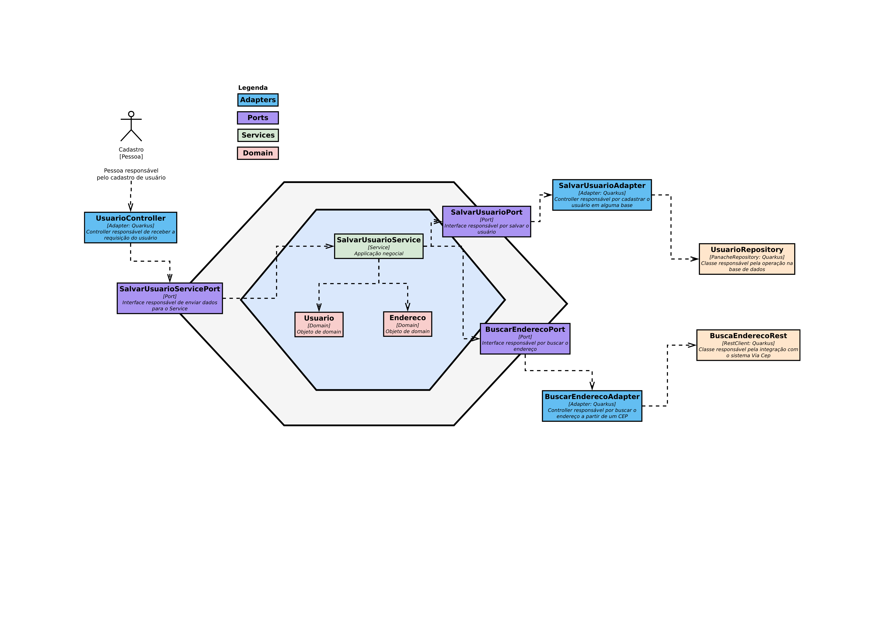

# Exemplo de arquitetura Hexagonal feita em Quarkus

Esse projeto foi feito para explicar melhor sobre a arquitetura Hexagonal, podendo ter sido feito
com qualquer outra linguagem ou framework.

## Para rodar a app na sua máquina

Comando para iniciar um container configurado para o ambiente do projeto:

```shell
cd docker && docker compose up
```

Paralelamente, execute esse comando para iniciar o projeto:

```shell
./mvnw quarkus:dev
```

Veja a imagem de como está feita essa arquitetura em uma visão de componentes do C4 model:


